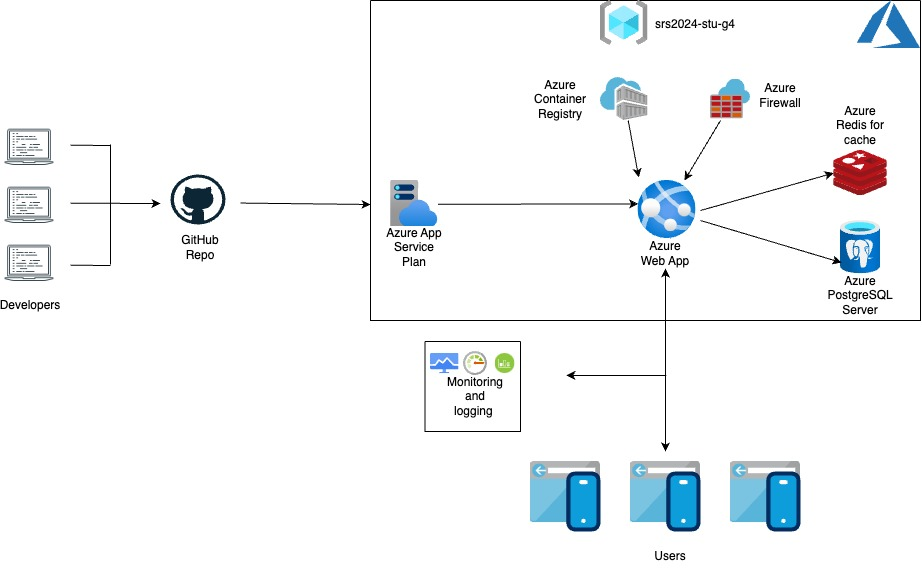

# Shodan-Eye Vulnerability Scanning

Shodan-Eye Vulnerability Scanning è una webapp sviluppata in Python utilizzando il framework Flask. La webapp sfrutta l'API di Shodan per eseguire scansioni di vulnerabilità su dispositivi e servizi esposti su Internet. Questo strumento è pensato per aiutare gli amministratori di rete e i professionisti della sicurezza a identificare potenziali rischi di sicurezza nelle loro infrastrutture.

## Caratteristiche

- **Scansione di vulnerabilità**: Utilizza l'API di Shodan per cercare e identificare dispositivi vulnerabili.
- **Network monitoring service**: Utilizza l'API di Shodan per creare servizi di monitoring per un IP-Address o una rete.
- **Interfaccia intuitiva**: Interfaccia web semplice e user-friendly realizzata con Flask.
- **Report dettagliati**: Visualizzazione dei risultati delle scansioni con dettagli sulle vulnerabilità trovate.
- **Facile configurazione**: Semplice da installare e configurare.

## Sito web

Per utilizzare l'app visita il sito web [Shodan-Scanning](https://shodanscanning.azurewebsites.net/).

## Utilizzo

1. Inserisci l'indirizzo IP o l'intervallo di IP che desideri scansionare.
2. Premi il pulsante "Scansiona" per avviare la scansione.
3. Visualizza i risultati delle scansioni e identifica le vulnerabilità nei dispositivi e servizi esposti.

## Contributi

I contributi sono benvenuti! Se desideri contribuire, per favore segui questi passaggi:

## Contatti

Per qualsiasi domanda o suggerimento, non esitare a contattarci.

---

Grazie per aver utilizzato Shodan-Eye Vulnerability Scanning!
